# 3020_Assignment3

### TEAM MEMBERS:

LUKA NIKOLAISVILI

FARZAD IMRAN

FREDERICK NKWONTA

# TEST CASES:

#### list all here

# PART A

### Positive values

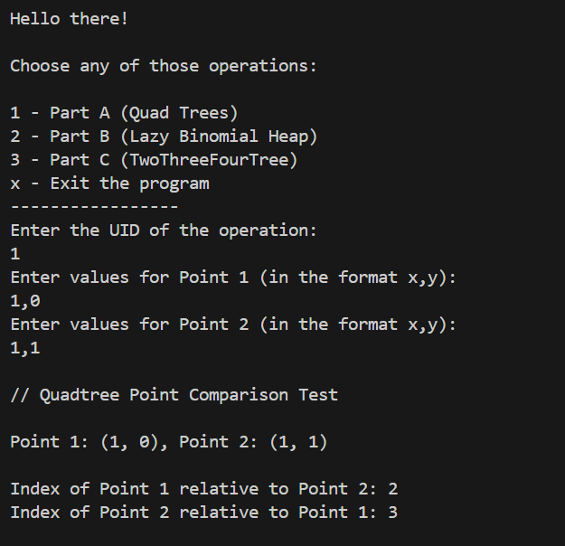

### negative values

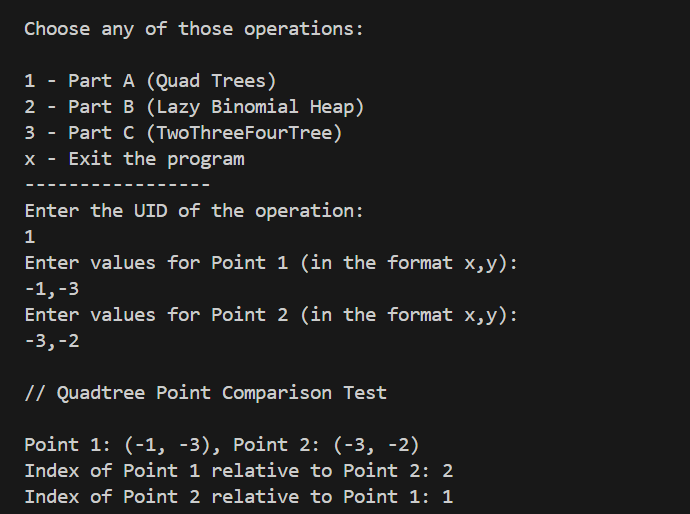

### Duplicate values

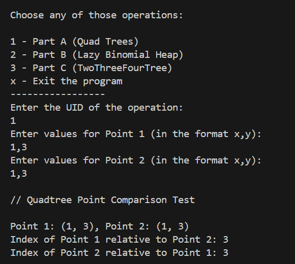

### Wrong input and Wrong format

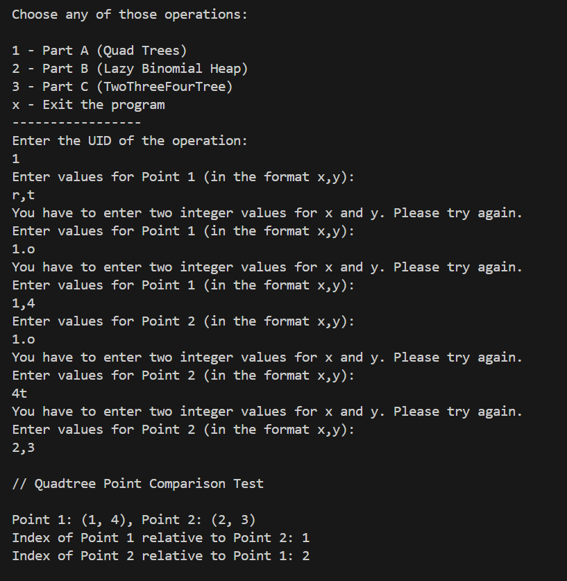

# PART B

### Add / front / remove

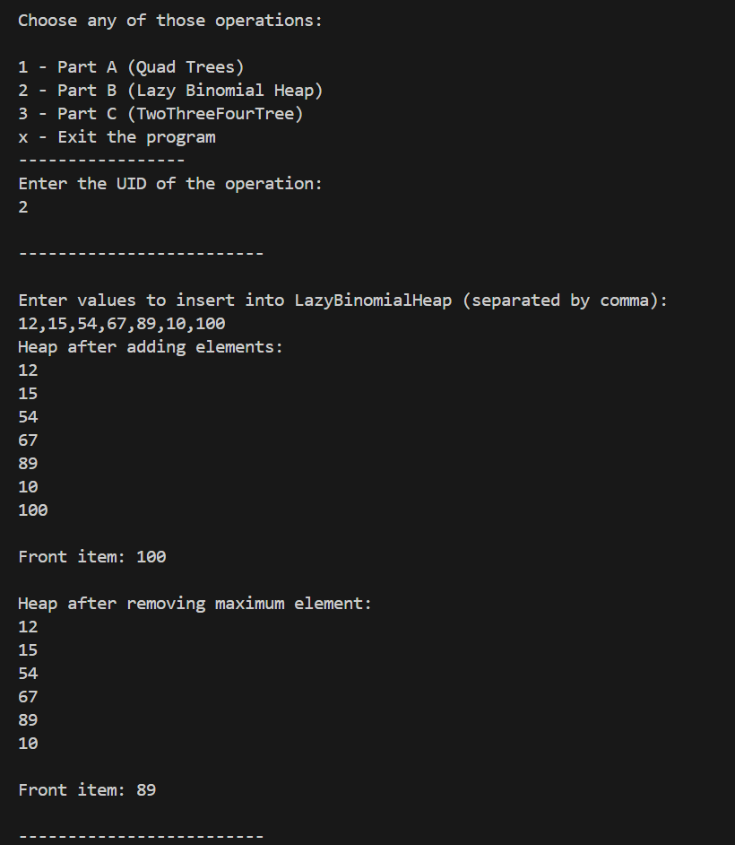

### Add /front /remove (invalild inputs)

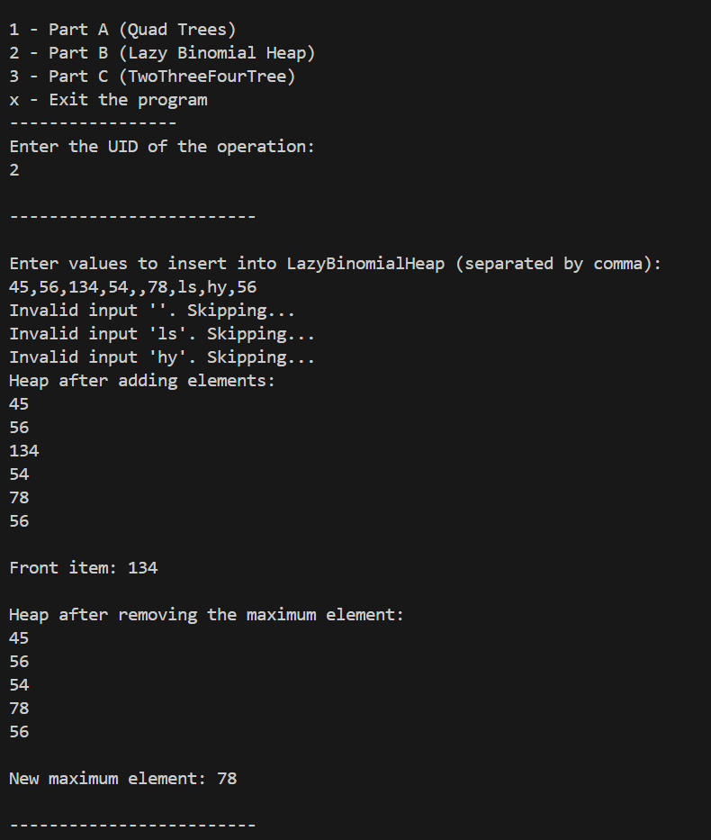

# PART C

### insert (Positive values)

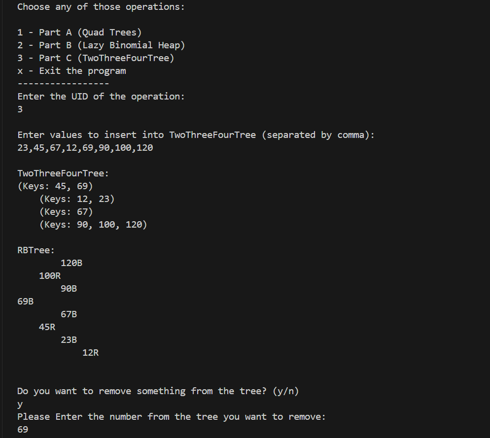

### Delete

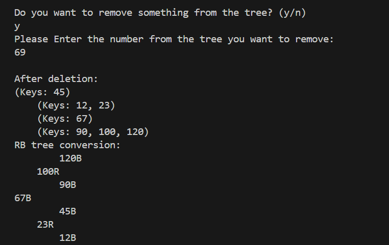

### search

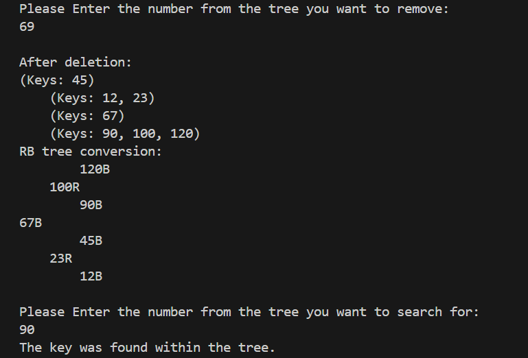

### Convert

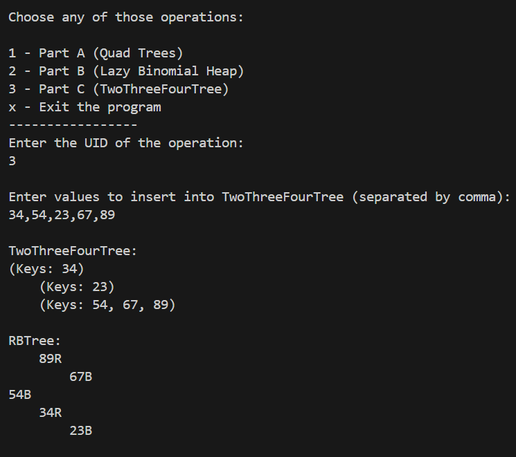

### insert (Larger values)

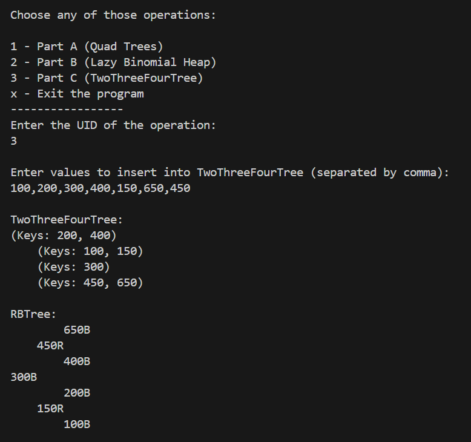

### Delete (removing a number not in the tree)

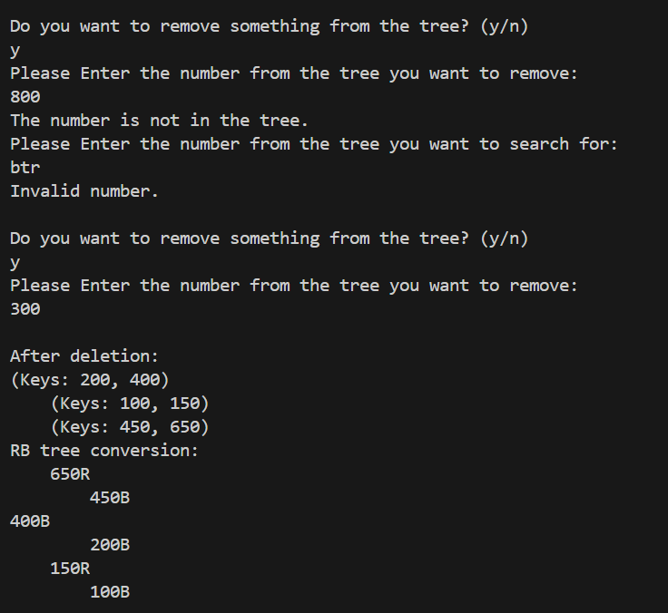

### search ( looking for a number not in the tree)

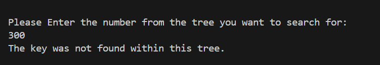

### Null insertion (Will the program crash if you enter a blank?)

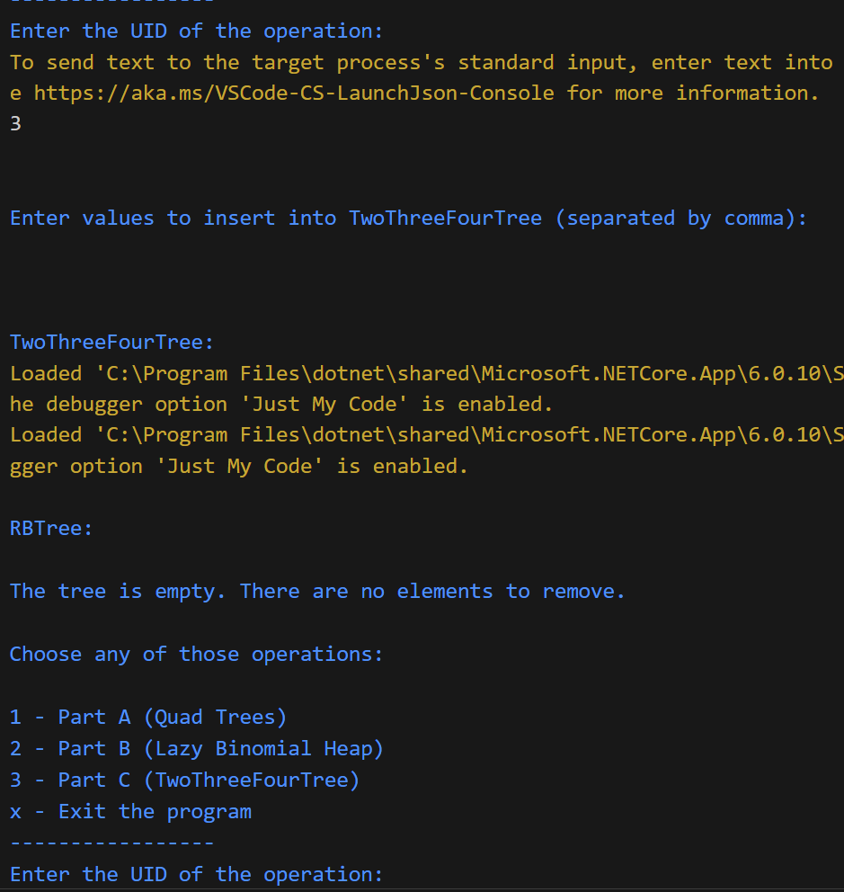

### Mix of characters and number (program should ignore characters)

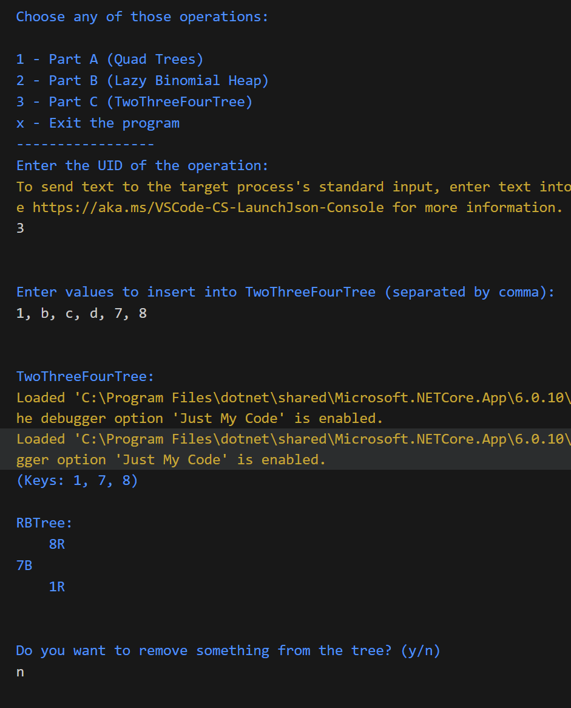

### Inserting duplicate values (Will it ignore them?)

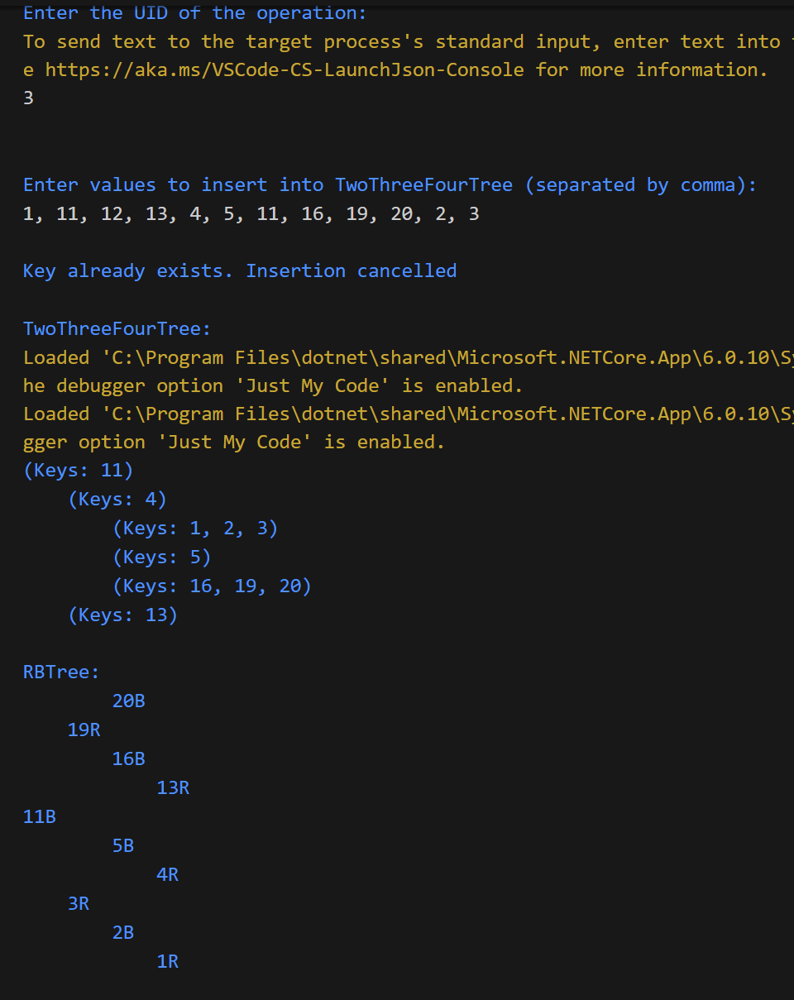

### deleting the root?

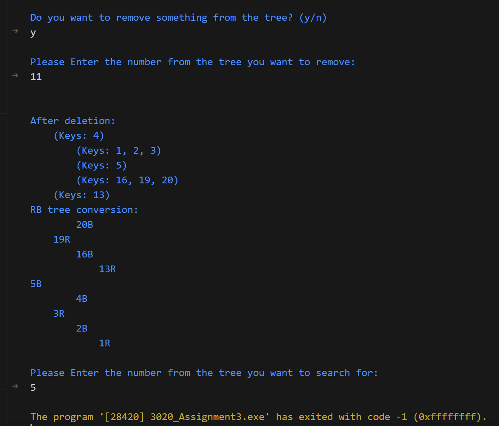
program fails to properly merge along the way and make a new root, this leads to unexpected behaviour and causes an infinite loop when going to search 

